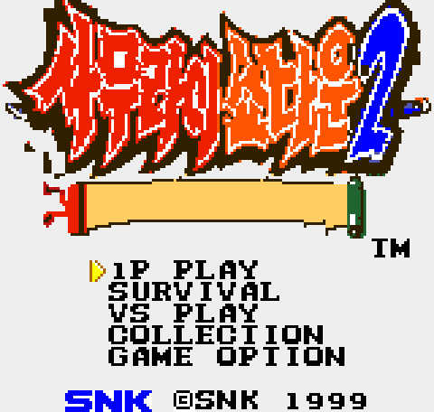
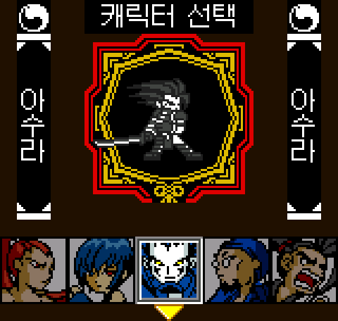
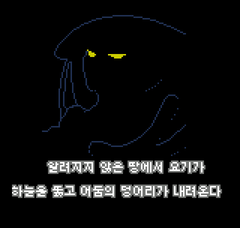
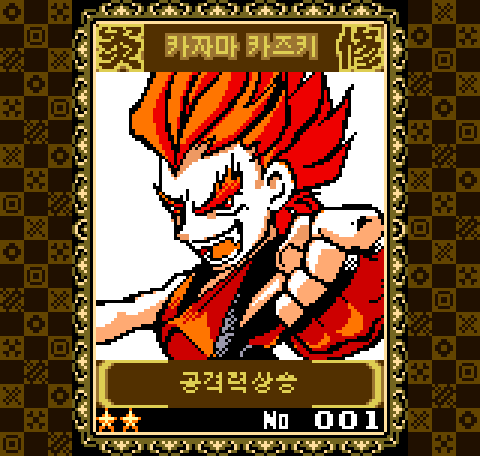
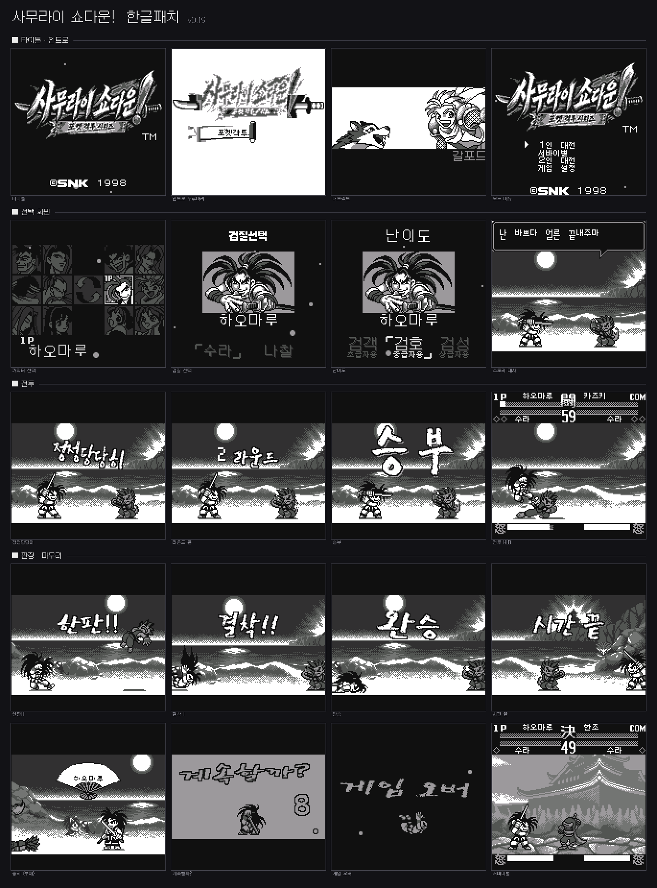

# KrPatch — 한글화 패치 모음

레트로 게임 비공식 한글화 패치 저장소입니다. 롬 파일은 포함·배포하지 않습니다.

---

## 사무라이 쇼다운! 2 (네오지오 포켓 컬러) — v0.63

- 패치: `ss2_korean_v0.63.ips` / 전 카드 해금판 `ss2_korean_v0.63_allcards.ips`
- 원본 롬에 IPS 도구(Lunar IPS, Flips 등)로 적용

| | |
|---|---|
|  |  |
|  |  |

---

## 사무라이 쇼다운! 1 (네오지오 포켓) — v0.19

- 폴더: [`SS1_SamuraiShodown_NGP/`](SS1_SamuraiShodown_NGP/) — 패치·빌드 도구·기술 문서 전부
- 패치: `SS1_SamuraiShodown_NGP/patches/SS1_Korean_v0.19.ips`
- 원본: `Samurai Shodown! (JUE) [M][!].ngp` (MD5 `d13f954b2f1c703bdf857837c24e332e`)
- 결과 MD5 `3a9136e3d51c8c3f3f0c296134e64535`
- 대사 198문장(받침 동시 출력 코드패치), 전투 그래픽 27종 붓글씨 아트, 로고·UI·HUD 전반

상세 내용과 리버스 엔지니어링 문서는 폴더 안 README 와 `docs/` 참조.

---

Samurai Shodown 시리즈는 SNK의 저작물입니다. 본 패치들은 비영리 팬 번역입니다.
