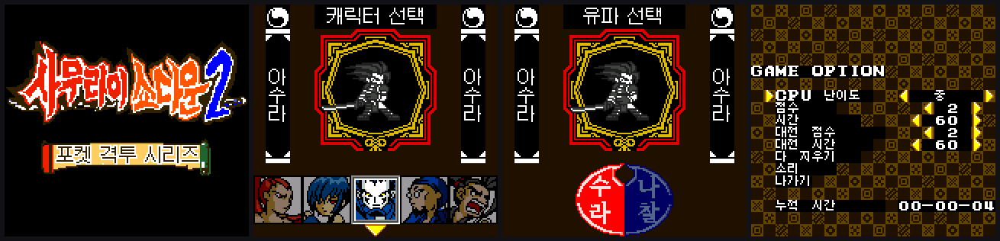
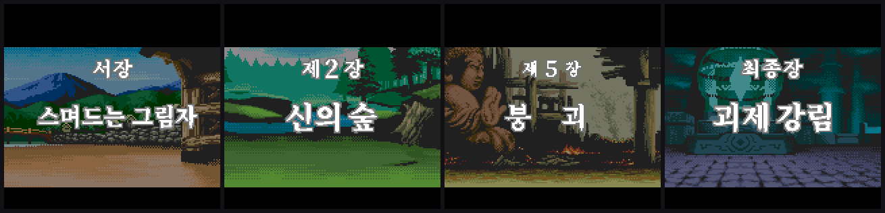
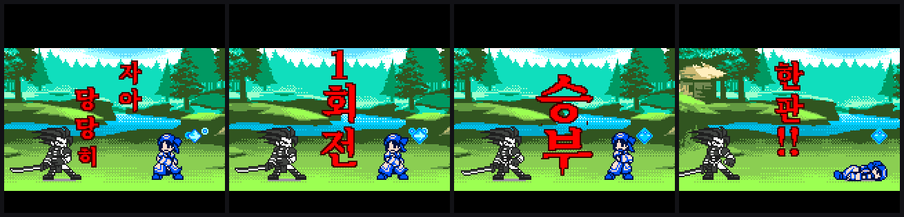
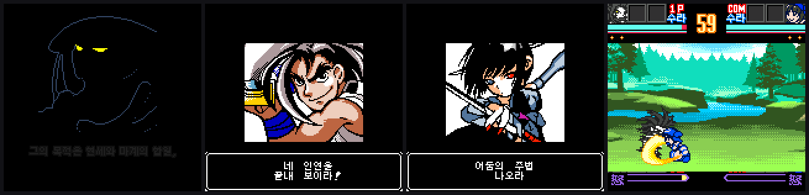
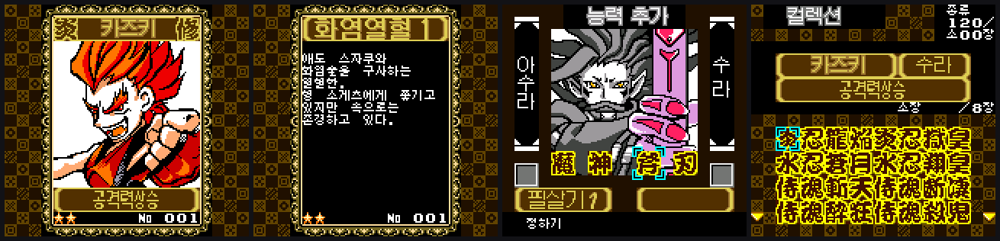
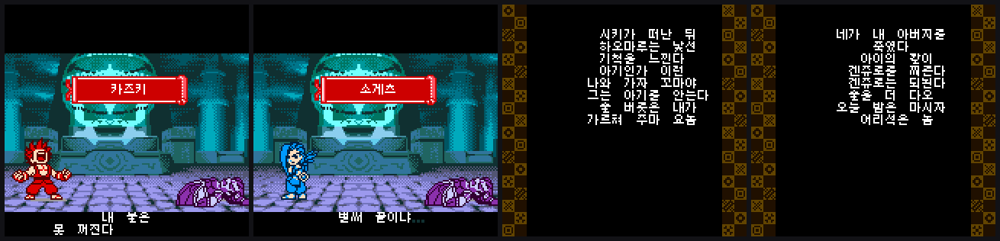

<!-- GATE:BEGIN -->
# 네오지오 포켓 컬러 — 한글패치 대문

이 저장소는 **한글패치(IPS)의 집**입니다. 아래 표에서 게임별 최신판을 받거나,
[**PocketCore 앱**](https://github.com/rmdkdkr-png/PocketCore/releases/tag/app)으로 전부 자동 적용하세요.

## 한글패치 최신판 (에뮬레이터·실기 공용)

| 게임 | 판 | 받기 |
|---|---|---|
| SNK vs. Capcom — 정상결전 최강 파이터즈 | v0.18 | [받기](https://github.com/rmdkdkr-png/KrPatch/releases/tag/SVC) |
| 사무라이 스피리츠! 2 | v0.99b3 | [받기](https://github.com/rmdkdkr-png/KrPatch/releases/tag/v0.99b3) |
| 사무라이 스피리츠! | v0.19 | [받기](https://github.com/rmdkdkr-png/KrPatch/releases/tag/ss1-v0.19) |
| 월화의 검사 특별편 | v2.3 | [받기](https://github.com/rmdkdkr-png/KrPatch/releases/tag/lastblade-v2.3) |
| 더 킹 오브 파이터즈 R-2 | v0.2.1 | [받기](https://github.com/rmdkdkr-png/KrPatch/releases/tag/kofr2-v0.2.1) |
| 아랑전설 퍼스트 컨택트 | v0.1a | [받기](https://github.com/rmdkdkr-png/KrPatch/releases/tag/ffc-v0.1a) |
| 메탈슬러그 1st 미션 | v0.1 | [받기](https://github.com/rmdkdkr-png/KrPatch/releases/tag/ms1-v0.1) |
| 메탈슬러그 2nd 미션 | v0.1 | [받기](https://github.com/rmdkdkr-png/KrPatch/releases/tag/ms2-v0.1) |

IPS 는 [Lunar IPS](https://www.romhacking.net/utilities/240/) 등으로 직접 입힙니다.
해시·적용법은 각 릴리즈 본문에 있습니다. 최근 무엇이 바뀌었는지는 앱의 소식창이나
[앱 릴리즈 본문](https://github.com/rmdkdkr-png/PocketCore/releases/tag/app)에서 봅니다.

제작 규칙은 [RELEASE_RULES.md](RELEASE_RULES.md) — 아래는 사무라이 쇼다운! 2 패치 상세.

---
<!-- GATE:END -->
# 사무라이 쇼다운! 2 — 한글 패치 (Samurai Shodown! 2 Korean Patch)

**SNK · 1999 · 네오지오 포켓 컬러** 용 `Samurai Shodown! 2 (JUE) [!]` 한글 패치입니다.
현재 버전 **v0.99b3**.

> ⚠️ 이 저장소에는 **ROM 파일이 없습니다.** IPS 패치만 배포합니다. 원본 ROM은 직접 준비하세요.

---

## 다운로드

| 파일 | 내용 |
|---|---|
| [`SS2_Korean_v0.99b3.ips`](SS2_Korean_v0.99b3.ips) | 기본판 |
| [`SS2_Korean_v0.99b3_allcards.ips`](SS2_Korean_v0.99b3_allcards.ips) | 올카드판 — 카드 121장 전부 개방된 세이브 포함 |

번역 내용은 두 판이 동일합니다.

## 적용 방법

1. 원본 ROM을 준비합니다. MD5가 `8d6a36acd3b171970d87d2fca6796a4a` 여야 합니다.
2. [Lunar IPS](https://www.romhacking.net/utilities/240/) 같은 IPS 패치 도구로 적용합니다.
3. 결과 MD5를 확인합니다.

| | MD5 |
|---|---|
| 원본 ROM | `8d6a36acd3b171970d87d2fca6796a4a` |
| 기본판 결과 | `8cca7fab896dafbaccb089175da28505` |
| 올카드판 결과 | `0e085549abe7a1f881b4174e1eea8371` |

MD5가 다르면 원본 ROM이 다른 것입니다.

**실기(플래시 카트)에서 동작합니다.** 세이브 플래시 블록을 건드리지 않으므로 세이브 후 재부팅해도 정상입니다.

---

## 화면

### 타이틀 · 메뉴 · 캐릭터 선택 · 설정

### 장 제목 — 붓글씨 서체

### 전투 구호

### 나래이션 · 난입 대사 · 전투

### 카드 121장 — 제목 · 설명 · 종류 라벨

### 엔딩 15종

> 진행 화면 34장 · 카드 120장 앞면/설명 · 엔딩 15종 전체는 **[gallery/](gallery/)** 에 있습니다. (엔딩은 스포일러 주의)

---

---

## 다른 패치

| 게임 | 최신 | 받기 |
|---|---|---|
| **SNK vs Capcom: Match of the Millennium** | v0.18 | [릴리즈](https://github.com/rmdkdkr-png/KrPatch/releases/tag/SVC) |
| **사무라이 쇼다운!** (NGP) | v0.19 | [릴리즈](https://github.com/rmdkdkr-png/KrPatch/releases/tag/ss1-v0.19) |
| **월화의 검사 특별편** | v0.22 | [릴리즈](https://github.com/rmdkdkr-png/KrPatch/releases/tag/lastblade-v0.22) |
| **더 킹 오브 파이터즈 R-2** | v0.2 | [릴리즈](https://github.com/rmdkdkr-png/KrPatch/releases/tag/kofr2-v0.2) |

## 번역 범위

- 타이틀 · 메뉴 · 캐릭터 선택 · 유파 선택 · 게임 설정
- 장 제목 9종(붓글씨) · 오프닝 나래이션
- 전투 시작·종료 구호 (자아 / 당당히 / N회전 / 승부 / 한판)
- 전투 중 대사 · 승리 대사 · 난입 대사
- 엔딩 15종
- 카드 121장 — 제목 · 설명 · 종류 라벨
- 전투 전 카드 장착 화면 · 카드 컬렉션
- 무한 대전 연승 표시 · 랭크 화면

---

## 무엇이 어려웠나

이 게임은 텍스트가 세 갈래로 흩어져 있고 각각 다른 방식으로 화면에 그려집니다.

**대사 폰트에 한글 자리가 120칸뿐입니다.** 8×8 픽셀 글자를 코드 하나에 한 자씩 대응시키는데 256칸이 이미 꽉 차 있습니다. 「얼」도 「굴」도 「신」도 「목」도 넣을 자리가 없었습니다. 그래서 이 작업의 본체는 번역이 아니라 **쓸 수 있는 120자에 맞춰 문장을 다시 짜는 일**이었습니다.

**큰 글자는 폰트가 아니라 타일 그림입니다.** 장 제목·이름판·카드 제목·구호가 전부 그렇습니다. 그림 아이템 254개를 전수 조사해 주소 지도를 만들고 한 장씩 다시 그렸습니다. 타일을 놓을 빈 공간이 없어 ROM 곳곳의 미사용 구역을 찾아 옮겨 심었습니다.

**카드 설명과 엔딩은 120자로 불가능합니다.** 문자열 엔진에 문맥별 글리프 뱅크 교체 훅을 넣어, 카드 설명을 그릴 때와 엔딩을 그릴 때 서로 다른 글자 세트를 물려주도록 했습니다.

자세한 내용은 [`docs/WORKLOG.md`](docs/WORKLOG.md)를 보세요.

---

## 변경 내역

### v0.99b3
- v0.99b1 이 「간다라」 타일을 카드 설명 글리프 풀의 머리에 얹어 생긴
  **카드 38장 49곳**의 설명 글자 깨짐을 수정 — 「간다라」 타일은 그대로 두고
  뭉개진 글리프 3장을 빈 슬롯 507·508·509 로 옮기고 페이지 리스트 49곳을 재지정
- 카드 095 제목 「몽롱 도」 → **「흐린칼」** 로 재조판 (원판 `朧　刀`).
  제목칸 4칸에 5글자가 안 들어가 3글자로 줄이고 자당 8px → 10px 로 키움

### v0.99b1
- 이름판 「수라」 → **「간다라」**
- ⚠️ 이 판에는 위의 카드 설명 깨짐이 있습니다. v0.99b3 으로 교체하세요.

### v0.99b
- 카드 종류 라벨 5종(`공격력상승`·`방어력상승`·`필살기 1`·`필살기 2`·`추가`)을 원판과 같은 12px로 전면 재조판
  - 7px / 9px / 13px 세 크기가 섞여 있던 것을 12px 하나로 통일
  - 외곽선을 걷어내 원판처럼 가는 획으로 — 명판 위에서 글자 속이 메워지던 것 해소
  - 숫자 1·2는 원판 이탤릭 글리프를 그대로 이식
  - 「추가」와 「필살기」가 맞닿던 것을 5px 띄움 → 「추가 필살기 1」
- 이 라벨은 카드 앞면·컬렉션·전투 전 「능력 추가」 화면에 공통으로 쓰입니다

### v0.99a
- 전투 대사 96개를 원판과 전수 대조 — 과생략·의미반전 4건 교정
  - 「네 연을」 → 「네 인연을」 (원판 `宿縁`)
  - 「더는 못 간다」 → 「너는 / 더 못 지나간다」 (의미가 반대로 뒤집혀 있던 것)
  - 「제법이다 / 놈이로군」 → 「제법이다 / 인정하마」
  - 「어리석은 / 놈아」 → 「유가의 적인 / 놈아」
- 말풍선 대사 정렬을 가운데로 교정 (이전에는 왼쪽으로 40px 쏠림)
- 마침표·쉼표가 앞 글자와 떨어져 보이던 것 교정
- 연승 격파수를 한글 수사에서 숫자로 (「이인격파」 → 「15인 격파」)
- 전투 시작 구호 「정정당당히」를 원판 크기에 맞춰 「당당히」로 재조판
- 「승부」의 '부' 글자 테두리가 끊겨 있던 것 보수

### v0.98
- 장 타이틀 헤더·부제 17종을 원판 붓글씨풍 3톤 서체로 전면 교체
- 부제가 화면 왼쪽으로 쏠려 보이던 배치를 정중앙으로 보정

### v0.97
- 일본어로 남아 있던 카드 제목 5장 한글화 — 120장 전부 한글
- 카드 제목 문안 교차 검수 반영, 주베이 표기 통일

### v0.96
- 나코루루 세로 이름판 · 최종장 부제 「괴제 강림」 파손 복원
- 그림 아이템 254종 전수 주소맵 검수

### v0.95
- 카드 제목 120장 한글화
- 카드 모음집 오역 수정 (`카드 장착` → `카드 주기`)
- 유파 판 「나찰」 가로줄 복원, `N 人抜き` → `N 연승`

### v0.93 – v0.90
- **v0.93** 서장 나래이션 둘째 줄이 화면 왼쪽에 붙어 잘려 보이던 것 재조판
- **v0.92** ★ 실기에서 세이브 후 화면이 검게 죽던 문제 해결 — 패치 데이터를 세이브 플래시 블록 밖으로 이전
- **v0.91** 우쿄 기침 대사가 깨져 나오던 것 수정
- **v0.90** 말줄임표가 점 하나로 찍히던 것 수정

---

## 알려진 사항

- **대사 폰트는 한글 120자 제약이 있습니다.** 후반부 일부 대사가 어색한 것은 이 때문입니다.
- 「공격력상승」·「방어력상승」은 다섯 글자를 48픽셀에 넣어야 해서 장체(폭이 좁은 글자)입니다. 높이는 나머지와 같습니다.
- 전투 전 「능력 추가」 화면에서는 「추가」가 붙지 않고 「필살기 1」로만 나옵니다. 슬롯이 8칸뿐이라 원판(`必殺技1`)도 같습니다.
- 카드 63(LST)은 원판 그림 그대로입니다.
- 카드 목록 화면의 이름(`侍魂斬天` 등)과 분노 게이지의 `怒`는 원판 그대로 두었습니다.
- 컬렉션 화면의 소장 매수 표시가 조금 겹쳐 보입니다.
- 2인 대전(링크 케이블) 판정 문구는 번역돼 있으나 실기 2대로만 확인 가능합니다.
- 세이브 데이터가 있는 상태에서 패치를 새로 적용하면 저장 기록이 초기화됩니다.

## 검증

- 그림 아이템 **254개 전수 렌더 대조** — 버전마다 의도한 것만 바뀌었는지 픽셀 단위 회귀
- 세이브 플래시 블록 `0x1D0000~0x1DFFFF`, `0x1F0000~0x1FFFFF` 원본과 바이트 동일
- IPS를 원본에 적용 → 결과 ROM과 바이트 일치 (왕복 검증)
- 모든 화면 에뮬레이터 캡처로 눈 검수
- 별도 세션이 독립적으로 재검증

## 버그 제보

[Issues](../../issues)에 화면 사진과 함께 올려 주세요. 어느 판(기본/올카드)인지, 어떤 에뮬레이터 또는 플래시 카트인지 적어 주시면 좋습니다.

## 라이선스 · 저작권

- 원본 게임의 저작권은 **SNK**에 있습니다. 이 저장소는 팬 번역 패치만 배포하며 게임 데이터를 포함하지 않습니다.
- 한글 글꼴 [Galmuri](https://github.com/quiple/galmuri) — SIL Open Font License 1.1
- 개인 소장용입니다. **ROM 파일은 배포하지 마세요.**
