# 사무라이 쇼다운! 2 한글 패치

**Samurai Shodown! 2 (Neo Geo Pocket Color, SNK 1999) — 한국어 번역 패치**

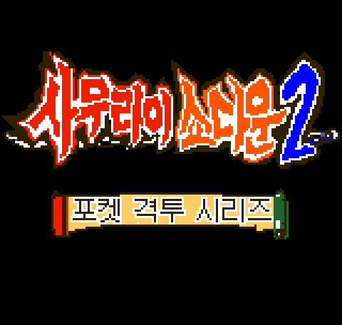

---

## 다운로드

**[→ 최신 패치 받기 (Releases)](../../releases/latest)**

| 파일 | 설명 |
|---|---|
| `SS2_Korean_v0.95.ips` | 한글 패치 (일반) |
| `SS2_Korean_v0.95_allcards.ips` | 카드 전부 해금판 — 도감을 바로 보고 싶을 때 |

패치 파일만 배포합니다. **롬(ROM) 파일은 포함되어 있지 않고, 요청에도 응하지 않습니다.**

---

## 적용 방법

**원본 롬**

```
파일명 : Samurai Shodown! 2 (JUE) [!].ngc
크기   : 2,097,152 바이트
MD5    : 8d6a36acd3b171970d87d2fca6796a4a
```

MD5가 다르면 정상 적용되지 않습니다.

**PC** — [Floating IPS (Flips)](https://www.smwcentral.net/?p=section&a=details&id=11474) 또는 Lunar IPS(LIPS)에 원본 롬 + `.ips`를 넣고 패치

**안드로이드 / 브라우저** — [ROM Patcher JS](https://www.marcrobledo.com/RomPatcher.js/) 에서 롬과 ips를 올리면 바로 패치된 파일이 나옵니다

**에뮬레이터** — RetroArch(Beetle NeoPop 코어), NeoPop, Mednafen 등

**패치 후 MD5**

```
SS2_Korean_v0.95.ips          → 0ef521f3c7d3b8039647eced70bce684
SS2_Korean_v0.95_allcards.ips → 193f047bf3bab2f31d622f109af1501f
```

---

## 실제 구동 모습

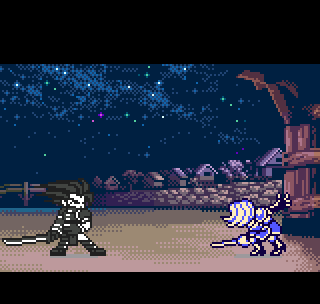

라운드 판정 「승부결정」·「완승」 → 이름 두루마리와 승리 대사 → 다음 장 전환까지, 실기 속도 그대로입니다.

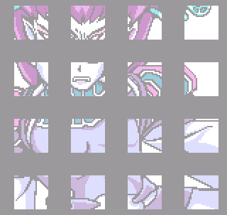

캐릭터별 엔딩 15종이 전문 한국어로 나옵니다.

---

## 화면

| | |
|:--:|:--:|
| 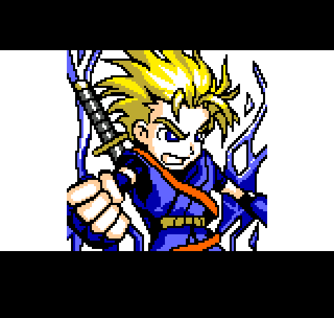 | 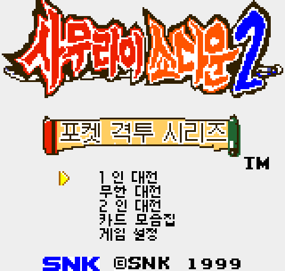 |
| 오프닝 | 타이틀 메뉴 |
| 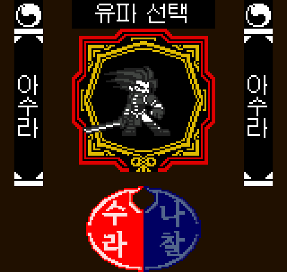 | 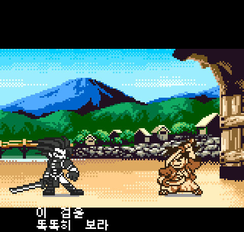 |
| 유파 선택 (수라/나찰) | 전투 대사 |
| 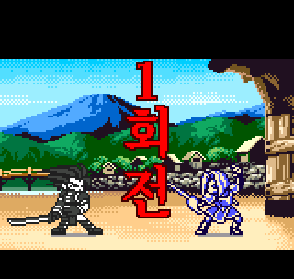 | 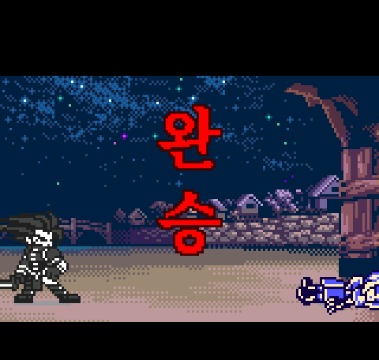 |
| 라운드 콜 (붓글씨체) | 판정 문구 |
| 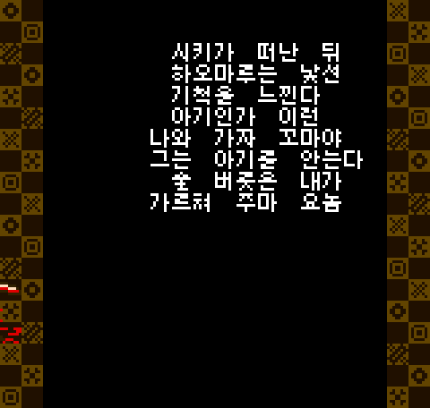 | 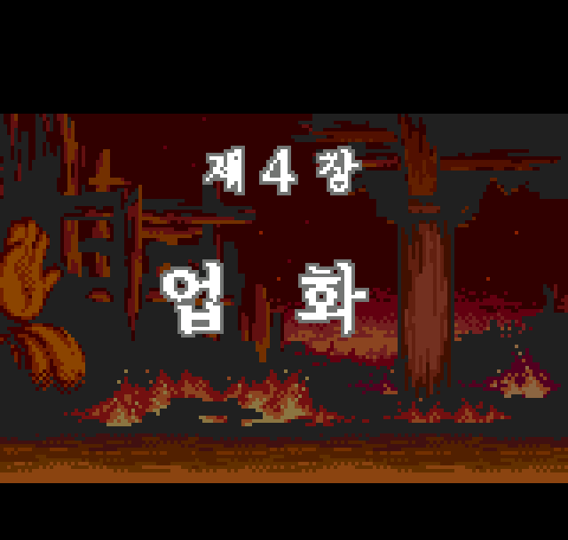 |
| 엔딩 전문 | 장 제목 |

**카드 도감** — 앞면과 뒷면(제목·설명) 전부 한글

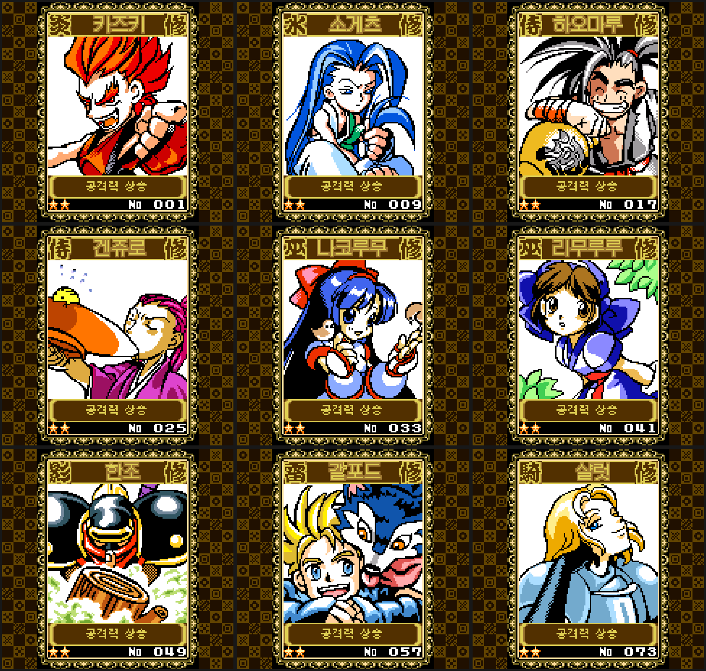

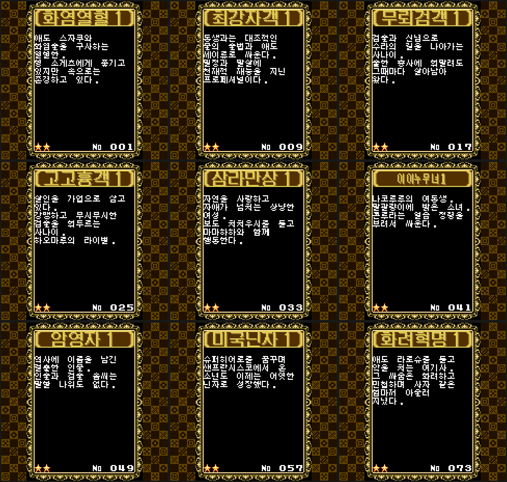

---

## 번역 범위

**타이틀 · 메뉴** — 한글 로고, 타이틀 메뉴(1인 대전 / 무한 대전 / 2인 대전 / 카드 모음집 / 게임 설정), 컬렉션, 게임 옵션, 카드 주고받기

**캐릭터 이름** — 하오마루, 나코루루, 리무루루, 갤포드, 샬럿, 우쿄, 한조, 겐주로 등 전 캐릭터. 대전 전 상대 이름 두루마리 포함

**전투 중 문구** — 판정 문구("완승", "시간 종료" 등)와 도발·승리 대사 전 캐릭터분. 원판 한자 붓글씨의 질감을 살리려고 별도 렌더러를 만들었습니다

**스토리 모드** — 장 제목과 도입부 내레이션 전체

**엔딩** — 캐릭터별 엔딩 15종 전문

**카드 도감** — 카드 설명문 전체 120종 + **카드 제목 120장** (`炎の熱血漢` → `화염열혈`). "공격력 상승" 같은 종류 표시 포함

**무한 대전** — 연승 카운터 `N 人抜き` → `N 연승`

---

## 번역하지 않고 남긴 부분

정직하게 적습니다.

- **카드 목록 화면의 한자 이름** (`侍魂斬天` 등) — 디자인 요소로 보고 그대로 뒀습니다
- **분노 게이지의 `怒`** — 원판 유지
- **카드 제목 5장** (63·83·87·88·103) — 원본 글자가 뭉개져 판독이 안 되어 일본어 그대로
- **스태프롤** — 손대지 않았습니다

알려진 사항: 컬렉션 화면의 소장 매수 표시가 조금 겹쳐 보입니다. 플래시 카트 실기 구동은 검증 중입니다 — 문제가 있으면 이슈로 알려주세요.

---

## 왜 까다로운 작업이었나

네오지오 포켓 컬러는 화면이 **160×152 픽셀**이고, 글자 하나가 **8×8 픽셀** 칸에 들어갑니다. 한글은 자음·모음이 겹치는 구조라 이 크기에서 읽히게 만드는 것 자체가 과제입니다.

게다가 이 게임은 **폰트 코드 공간이 고정**되어 있습니다. 한자·가나는 종류가 적어도 되지만 한글은 음절마다 별도 글자가 필요해서, **쓸 수 있는 어휘 안에서 문장을 다시 쓰는** 작업이 필요했습니다.

큰 글씨(판정 문구, 장 제목, 이름표, 카드 제목)는 8×8 폰트가 아니라 **프리렌더된 타일 묶음**이라, 타일 개수 예산 안에서 글자를 새로 그려 넣어야 했습니다. 카드 제목은 원판 문구를 `화염열혈`처럼 **한자어로 압축**해 칸 수를 맞췄습니다.

---

## 버전 기록

### v0.95
- **카드 제목 120장 한글화**
- 카드 모음집 메뉴 오역 수정 — `카드 장착` → `카드 주기`
- 유파 판 「나찰」의 위아래 가로줄이 빠져 있던 것 복원
- 무한 대전 연승 카운터 `N 人抜き` → `N 연승`

### v0.93
- 서장 나래이션 둘째 줄이 화면 왼쪽에 붙어 잘려 보이던 것 재조판

### v0.92
- **실기에서 세이브 후 화면이 검게 죽던 문제 해결** (패치 데이터를 세이브 영역 밖으로 이전)

### v0.91
- 우쿄 기침 대사가 깨져 나오던 것 수정

### v0.90
- 말줄임표가 점 하나로 찍히던 것 수정

### v0.89 이전
- 대사·메뉴·스토리·엔딩·카드 설명 한글화, 한글 로고, 붓글씨 렌더러 등 기반 작업

---

## 사용 조건

개인 소장용입니다. ROM 파일 자체는 배포하지 마세요. 패치(IPS) 파일만 공유해 주세요.
