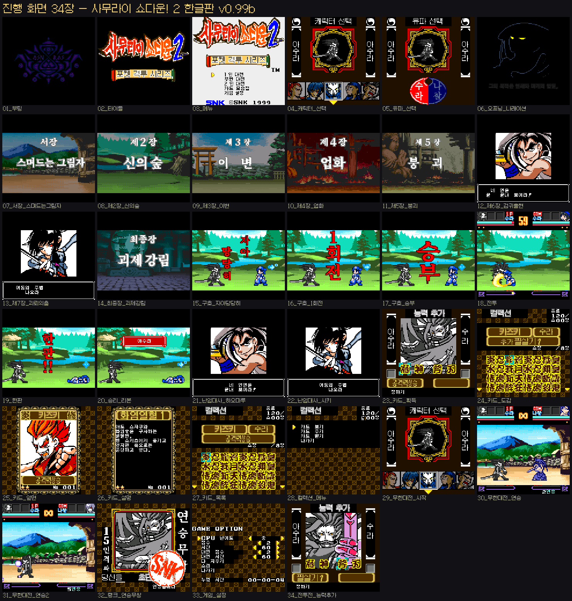
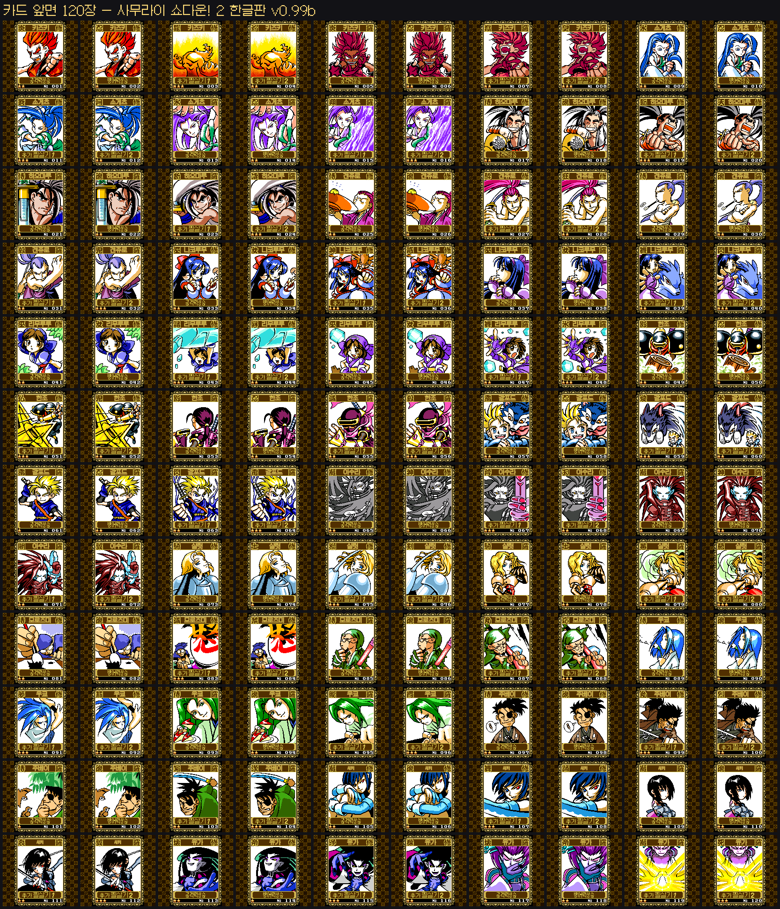
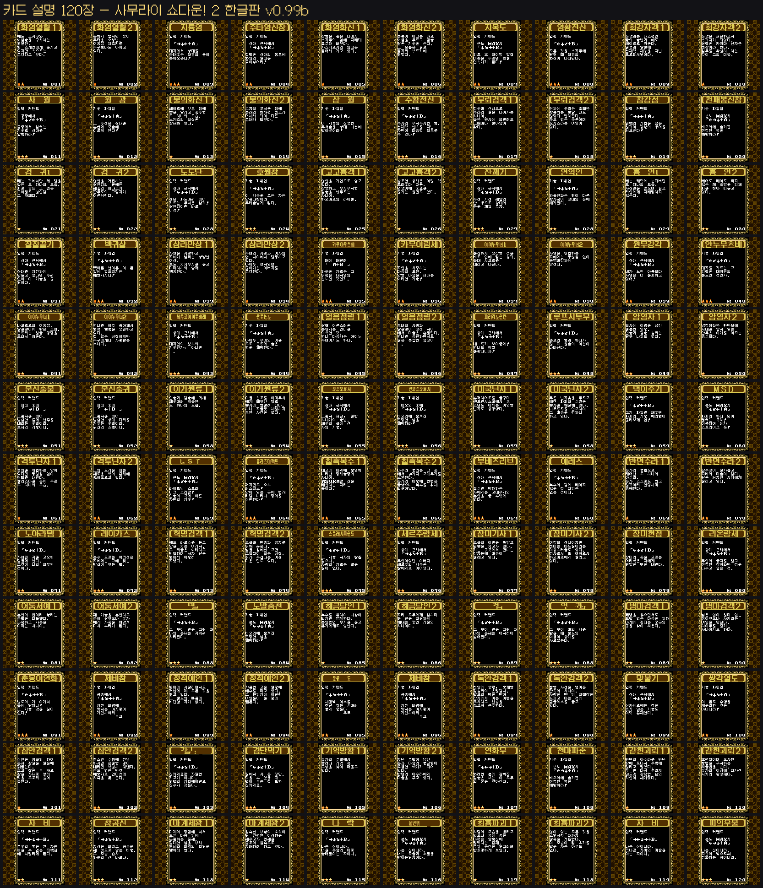
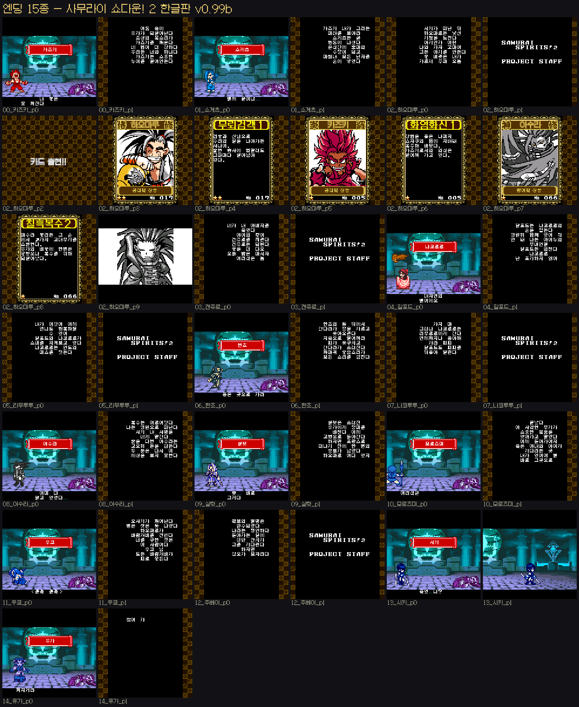

# 화면 모음 (Gallery)

## 진행 화면 34장

개별 파일은 [`screenshots/`](../screenshots/) 폴더에 있습니다.

## 카드 120장 — 앞면

## 카드 120장 — 설명

## 엔딩 15종 ⚠️ 스포일러

---

## 화면 이름 대조표

| 파일 | 화면 |
|---|---|
| `01_boot.png` | 01 부팅 |
| `02_title.png` | 02 타이틀 |
| `03_menu.png` | 03 메뉴 |
| `04_char_select.png` | 04 캐릭터 선택 |
| `05_school_select.png` | 05 유파 선택 |
| `06_opening_narration.png` | 06 오프닝 나래이션 |
| `07_ch0_creeping_shadow.png` | 07 서장 스며드는그림자 |
| `08_ch2_gods_forest.png` | 08 제2장 신의숲 |
| `09_ch3_anomaly.png` | 09 제3장 이변 |
| `10_ch4_karmic_flame.png` | 10 제4장 업화 |
| `11_ch5_collapse.png` | 11 제5장 붕괴 |
| `12_ch6_sword_demon.png` | 12 제6장 검귀출현 |
| `13_ch7_puppet_dance.png` | 13 제7장 괴뢰의춤 |
| `14_final_evil_emperor.png` | 14 최종장 괴제강림 |
| `15_call_ready.png` | 15 구호 자아당당히 |
| `16_call_round1.png` | 16 구호 1회전 |
| `17_call_bout.png` | 17 구호 승부 |
| `18_battle.png` | 18 전투 |
| `19_ippon.png` | 19 한판 |
| `20_victory_ribbon.png` | 20 승리 리본 |
| `21_intrusion_haohmaru.png` | 21 난입대사 하오마루 |
| `22_intrusion_shiki.png` | 22 난입대사 시키 |
| `23_card_equip.png` | 23 카드 획득 |
| `24_card_index.png` | 24 카드 도감 |
| `25_card_front.png` | 25 카드 앞면 |
| `26_card_desc.png` | 26 카드 설명 |
| `27_card_list.png` | 27 카드 목록 |
| `28_collection_menu.png` | 28 컬렉션 메뉴 |
| `29_survival_start.png` | 29 무한대전 시작 |
| `30_survival_streak.png` | 30 무한대전 연승 |
| `31_survival_streak2.png` | 31 무한대전 연승2 |
| `32_rank.png` | 32 랭크 연승무쌍 |
| `33_game_option.png` | 33 게임 설정 |
| `34_pre_battle_equip.png` | 34 전투전 능력추가 |
| `_contact_sheet.png` |  전체 |

## endings/

| 파일 | 캐릭터 |
|---|---|
| `00_kazuki_p*.png` | 카즈키 |
| `01_sogetsu_p*.png` | 소게츠 |
| `02_haohmaru_p*.png` | 하오마루 |
| `03_genjuro_p*.png` | 겐쥬로 |
| `04_galford_p*.png` | 갈포드 |
| `05_rimururu_p*.png` | 리무루루 |
| `06_hanzo_p*.png` | 한조 |
| `07_nakoruru_p*.png` | 나코루루 |
| `08_asura_p*.png` | 아수라 |
| `09_ending_p*.png` | 샬럿 |
| `10_ending_p*.png` | 모로즈미 |
| `11_ukyo_p*.png` | 우쿄 |
| `12_ending_p*.png` | 주베이 |
| `13_shiki_p*.png` | 시키 |
| `14_ending_p*.png` | 유가 |

## 그 밖

| 파일 | 내용 |
|---|---|
| `README.md` | 패치 소개·적용법·변경내역 |
| `WORKLOG.md` | 작업 기록 |
| `patch/*.ips` | IPS 패치 2종 |
| `cards/front/NNN.png` | 카드 N번 앞면 |
| `cards/desc/NNN.png` | 카드 N번 설명 |

