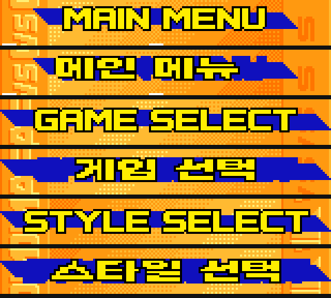
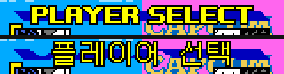

# SVC MotM 한글화 — 타이틀 · 메뉴 머리글 · 이름판

| | 원문 | 한글 | 방식 |
|---|---|---|---|
| 타이틀 머리글 | `頂上決戦` | **정상결전** | 타일맵 32타일 |
| 타이틀 큰 로고 | `最強ファイターズ` | **최강 파이터즈** | 타일맵 107타일 + SCR2 정리 111타일 |
| 타이틀 안내문 | `Aボタンを おし くださ` | **A버튼을 눌러 주세요** | 스프라이트 12타일 |
| 메뉴 머리글 3종 | `MAIN MENU` 등 | **메인 메뉴** 등 | 스프라이트 100타일 |
| 캐릭터 선택 머리글 | `PLAYER SELECT` | **플레이어 선택** | 타일맵 스트립 36타일 |
| 캐릭터 이름판 18종 | `KYO` 등 | **쿄** 등 | 이름풀 스트립 — [`docs/SVC_이름판.md`](../../docs/SVC_이름판.md) |

원판 안내문은 v17.2 에서 이미 「ください」의 「い」가 잘려 있다 — 12칸 중 10칸만 글자다.

윗줄이 v17.2, 아랫줄이 적용 후다 (왼쪽 타이틀 / 오른쪽 메인메뉴).


메뉴 머리글 세 화면. 짝마다 위가 원판, 아래가 적용 후다.



캐릭터 선택 머리글.



```bash
python3 build_title_ko.py   SVC_kr_v17.2.ngc _1.ngc --font Galmuri11-Bold.ttf --font7 Galmuri9.ttf
python3 build_logo_ko.py    _1.ngc _2.ngc            --font Galmuri11-Bold.ttf --ghost-grow 1
python3 build_headers_ko.py _2.ngc _3.ngc            --font Galmuri11-Bold.ttf
python3 build_player_ko.py  _3.ngc _4.ngc            --font Galmuri14.ttf
python3 bake_names_ko.py    _4.ngc 최종.ngc          --font Galmuri7.ttf

python3 check_headers.py    _2.ngc 최종.ngc --font Galmuri11-Bold.ttf   # 메뉴 머리글 픽셀 대조
python3 build_player_ko.py  _3.ngc 최종.ngc --font Galmuri14.ttf --check # 선택 머리글 픽셀 대조
python3 check_names.py            최종.ngc                              # 이름판 바이트 대조
```

입력은 **한글판 v17.2** (`md5 213b7d3fec3555273c992ad91137fdf7`)다. 원본 롬이 아니다.
다섯 단계를 거친 결과가 `md5 c7d7a604046761bdc1ef47c6400f07d6`, v17.2 대비 IPS 10,164바이트
(7,892바이트 변경). 각 빌더의 `--ips`는 자기 입력 기준 차분을 만들고 왕복 검증까지 한다.

`build_headers_ko.py`와 `bake_names_ko.py`는 **에뮬레이터를 띄워 관측**한다
(`--core` 로 libretro 코어 경로를 준다). `build_player_ko.py`는 굽는 데는 롬만 있으면 되고
`--check` 로 대조할 때만 에뮬레이터를 쓴다.

글꼴은 [Galmuri](https://github.com/quiple/galmuri) (SIL OFL 1.1) —
메뉴 머리글 Galmuri11-Bold, 선택 머리글 Galmuri14, 안내문 Galmuri9, 이름판 Galmuri7.

## 검증

눈으로 넘기지 않는다. 두 대조 도구가 구운 롬을 **직접 부팅해** 화면을 받아 본다.

    check_headers.py            메뉴 머리글 3종의 화면 합성을 도안과 픽셀 단위로 비교
    build_player_ko.py --check  선택 머리글 36칸을 화면대로 합성해 도안과 비교
    check_names.py              이름판 18종의 스트립 타일이 화면에 바이트 그대로 올라오는지 확인

현재 결과다.

    머리글 3종 전부 의도한 그림 그대로 화면에 뜬다
    다른 픽셀 0 / 2304 — 머리글이 의도한 그림 그대로 화면에 뜬다
    만난 판 18개 중 완전일치 18개 / 구운 이름 18종

`check_headers.py`는 어긋난 픽셀을 **공유 끝동강**(일부러 원판을 둔 자리)·
**격자 빈틈**(어느 스프라이트도 안 덮어 화면에서 빠지는 자리)·**설명 안 됨**으로 나눈다.
설명 안 되는 픽셀이 하나라도 있으면 실패로 끝난다.

## 알아낸 것

**타일이 롬에 여러 벌 있고, 읽히는 것은 하나다.**
머리글 타일은 `0x1B6xxx`와 `0x306xxx`에 같은 내용으로 있다. 한쪽만 바꿔 부팅해 화면이
변하는지 보는 방법으로 **`+0x150000` 쪽이 읽히는 사본**임을 확정했다.
관측 기록의 `slot2rom`은 내용이 처음 일치한 주소라 실제 출처가 아닐 수 있다 — 이 경우가 그랬다.

**안내문은 타일맵에 없다. 스프라이트다.**
VRAM 512슬롯 중 두 타일맵이 참조하지 않는 슬롯을 추려 찾았다. 패턴 0~11번이
`x = 28,36,44,52,60, 76,84,92,100,108,116,124` / `y = 115`에 놓인다 (60→76 이 띄어쓰기).
원판 글자는 10자, 빈 칸은 패턴 7·11.
타일 출처는 `0x2E7F70`부터 16바이트씩 **연속**이다 — 내용이 세 곳에서 일치해 주소 추정이
안 되던 것을 연속 배치를 단서로 확정했다.

「A버튼을」 4자 · 「눌러」 2자 · 「주세요」 3자 = 9자가 원판의 세 덩어리에 그대로 들어간다.

**Galmuri7은 ppem 8에서 그려야 한다.**
size 7로 그리면 한글이 6×6으로 뭉개진다 (「을」이 「슬」처럼 보인다). ppem 8이면 7×7로
제대로 떨어진다. 글자마다 bbox로 잘라내면 기준선이 어긋나므로 **고정 원점**으로 그린다.

## 메뉴 머리글에서 알아낸 것

**머리글도 스프라이트다.** 세 화면이 타일 풀 하나(`0x22A800`~`0x22AF00`, 112장)를 나눠 쓴다.

    MAIN MENU     타일  0~26
    STYLE SELECT  타일 27~62
    GAME SELECT   타일 64~98

**본체는 안 겹친다.** 겹치는 건 띠 끝동강 몇 장(99·102 등)뿐이고, 그건 글자가 없는 장식이라
원판 그대로 둬도 된다. 그래서 빌더는 **자기 구간 밖 타일을 아예 안 건드린다.**
이 규칙을 안 지키고 셋을 한 롬에 구웠더니 서로의 띠를 덮어써 셋 다 깨졌다.

**주소는 번호를 심어 읽는다.** 파란 띠 타일은 여러 장이 내용이 같아서 내용 검색의 첫 일치를
쓰면 남의 자리에 글자를 써 넣는다. 풀의 타일마다 `k mod 64` 자리에 점을 찍은 롬을 만들어
화면에서 번호를 직접 읽고, 후보 둘 중 원판 내용이 맞는 쪽을 골라 확정한다.

**한 화면 안에서도 타일이 겹친다.** `MAIN MENU` 는 32칸이 고유 타일 **30장**만 쓴다
(`MAIN` 의 M 과 `MENU` 의 M 이 같은 타일이다). 그 칸에 서로 다른 그림을 넣으면 나중 쓰기가
앞 쓰기를 덮어 두 칸 다 어긋난다 — 실제로 6칸이 깨졌다. 빌더는 **어절을 통째로 좌우로
밀어 가며** 겹친 칸의 그림이 같아지는 조판을 찾는다(「메인 메뉴」는 −1px 로 풀린다).
비교는 마스크가 아니라 **그린 결과**로 해야 한다 — 외곽선은 칸 경계를 넘어 번진다.

**스프라이트 격자에 빈틈이 있다.** 예를 들어 `x=24` 칸은 `y=7~14` 만 덮는다.
그 밖에 떨어진 획은 어느 타일에도 안 들어가 화면에서 사라진다. 조판 탐색에 이 손실을
넣어 최소인 자리를 고른다 (`MAIN MENU` 는 6픽셀이 한계다 — 화면에서는 안 보인다).

**띠를 같이 그려야 한다.** 이 타일에는 글자만이 아니라 **뒤에 깔린 파란 띠**도 들어 있다.
글자만 그리고 나머지를 투명으로 두면 띠가 글자 자리마다 끊긴다 — 실제로 한 번 끊어 먹었다.
띠 범위는 열마다 **파란 픽셀 + 원판 글자 픽셀**의 위아래 끝으로 잡는다. 원판 글자가 있던
자리는 띠가 덮고 있었기 때문이다.

**세로 중앙은 띠 본체 기준**으로 잡는다. 열마다 잰 범위의 **최빈값**을 쓴다.
끝동강까지 넣어 최대/최소를 쓰면 글자가 위로 밀려 화면 밖으로 잘린다
(`STYLE SELECT` 에서 실제로 잘렸다).

**y 값이 여러 개인 것은 애니메이션이 아니다.** 끝동강이 별도 스프라이트라서다.
글자 자체는 가로 한 줄이고, 900프레임을 지켜봐도 좌표가 안 변한다.

**색 인덱스는 1=검은 외곽선, 2=노란 채움, 3=글자 뒤 파란 띠**다.
처음에 3을 외곽선으로 짚었다가 글자가 파랗게 나와 실측으로 바로잡았다.

### 헛다리 (다시 하지 말 것)

1. **주소를 내용으로 찾기** — 띠 타일은 여러 장이 내용이 같다. 번호를 심어야 한다
2. **띠를 끝동강 사이로 보간** — 끝동강이 뾰족해서 가운데가 홀쭉해진다
3. **띠 범위를 파란 픽셀로만 재기** — 글자에 가린 열은 파란 픽셀이 없어 띠가 얇아진다
4. **「막혔다」고 접기** — 한때 `GAME`·`STYLE SELECT` 는 못 한다고 결론 내고 문서까지
   남겼다. 틀렸다. 도안과 화면을 픽셀로 대조해 보니 그때 이미 맞게 나오고 있었고,
   검증용 잘라내기(`crop((0,0,160,26))`)가 머리글을 잘라먹고 있었을 뿐이다.
   **검증 도구가 틀렸을 가능성을 먼저 의심해야 했다**

## 캐릭터 선택 머리글에서 알아낸 것

**여기는 스프라이트가 아니라 타일맵이다.** `SCR1` 행0~1 × 열1~18(144×16px)에 뜨고,
VRAM 슬롯이 134~169로 이어진다. 타일은 `0x31F810` 부터 **연속 36장**, 이름판과 같은
`[윗줄 18장][아랫줄 18장]` 스트립이다. 36슬롯 전부가 `start + i*16` 을 유일하게 만족했고,
첫 타일에 표식을 심어 부팅해 화면 행0·열1 만 변하는 것을 확인했다 — **읽히는 사본이 맞다.**
관측 9화면 중 이 구간을 쓰는 것은 캐릭터 선택뿐이라 다른 화면과 안 나눠 쓴다.

**파란 띠가 글자보다 얇다.** 띠는 y6~11(6px), 글자는 y3~13(11px)이라 글자가 띠 위아래로
삐져나온다. 메뉴 머리글의 "원판 글자 자리도 띠에 포함" 규칙을 그대로 쓰면 띠가 글자 높이만큼
두꺼워진다. 여기서는 **띠가 보이는 열에서 끝을 읽고 가린 열은 양옆에서 보간**한다.
메뉴 머리글에서 보간이 실패한 것은 아는 열이 뾰족한 끝동강뿐이어서였고, 여기는 144열 중
80열이 띠를 직접 보여 주며 빈 구간이 5열을 안 넘는다 — 조건이 다르다.

**글꼴을 여기만 바꿨다.** 후보를 전부 그려 놓고 골랐다.

| 후보 | 결과 |
|---|---|
| Galmuri11-Bold ppem11 가로×2 | 「플」이 통짜 덩어리가 된다. ㅍ·ㅡ·ㄹ 이 전부 가로획인데 가로만 늘리니 획이 2px/1px 로 어긋난다 |
| Galmuri7 ppem8 ×2 (등방) | 7×7 에 「플」·「택」 받침이 안 들어가 획이 붙는다. 이름판의 「쿄」·「테리」가 됐던 건 글자가 단순해서였다 |
| **Galmuri14 ppem14 (등방·원본 크기)** | 음절이 또렷하다. 스트립이 16px 라 배율 없이 들어간다 |

**늘릴 자리가 있으면 안 늘리는 쪽이 낫다.** 다른 자리에서 가로만 늘린 것은 띠가 12px 뿐이라
선택지가 없어서였지, 늘리는 게 좋아서가 아니었다.

## 안내문 글꼴 — 8x8 을 다 써야 한다

처음엔 Galmuri7(7x7)로 그렸는데 「을」이 「슬」로, 「요」가 「오」로 보였다.
**Galmuri9 를 ppem 9 로 그리고 1px 위로 올리면** 잉크가 8x8 을 꽉 채워 제대로 읽힌다.
7px 은 한글 종성이 들어갈 자리가 안 나온다.

## 큰 로고에서 알아낸 것

**로고는 두 평면에 걸쳐 있다.** SCR1 에 채움, **SCR2 에 외곽선 사본**이 따로 그려져 있다.
SCR1 만 고치면 SCR2 쪽 일본어 윤곽이 유령처럼 남는다. 그래서 원판 로고가 차지하던
픽셀 범위를 1px 부풀려 SCR2 에서 투명으로 지우는 2차 패스를 넣었다.

**맨 아랫줄(행10)은 못 쓴다.** 열9와 열10 이 한 슬롯(`0x1B7690`)을 공유해서 서로 다른
그림을 넣을 수 없다. 그리는 높이를 48px 로 제한하고 그 줄은 비워 둔다.

배치는 「최강 파이터즈」 한 줄, 가로 2배·세로 4배(음절당 약 19 × 40px).
원판도 한 줄이고 글자가 세로로 긴 비례라 거기에 맞췄다.

## 조판 원칙 — 픽셀 글꼴은 정수 배율로만

처음에 Galmuri11-Bold(11px)를 ppem 16 으로 렌더했다가 획이 갈라졌다.
11 -> 16 은 1.45배라 어떤 열은 1px, 어떤 열은 2px 이 된다.
**정수 배율로만 늘린다.** 지금은 이렇게 쓴다.

| 자리 | 글꼴 | 배율 | 결과 |
|---|---|---|---|
| 타이틀 머리글 | Galmuri11-Bold ppem11 | ×2 | 20px |
| 타이틀 안내문 | Galmuri9 ppem9 | ×1 | 8×8 (칸을 꽉 채운다) |
| 큰 로고 | Galmuri11-Bold ppem11 | 가로×2 세로×4 | 약 19×40px |
| 메뉴 머리글 | Galmuri11-Bold ppem11 | 가로×2 | 20×10px |
| 선택 머리글 | Galmuri14 ppem14 | ×1 (원본 크기) | 13×11~12px |
| 이름판 | Galmuri7 ppem8 | ×2 | 14×14 |

메뉴 머리글은 띠가 12px 뿐이라 세로를 못 키운다. **가로만 정수 2배**로 늘려
가독성을 얻는다 (1.5배로 늘렸다가 획이 고르지 않아 다시 짰다).

## 한계

- **쓸 수 있는 칸은 원판이 비어 있지 않던 자리뿐이다.** 타일맵을 못 고치므로 원판이 빈
  타일이던 칸에는 새 획을 못 넣는다. 머리글 가용 면적은 행1~3 × 열5~14 = **80×24px**이고,
  원판 「頂上決戦」이 쓰던 27px보다 3px 낮다. 그 안에 맞춰 짰다
- 타이틀 머리글은 원판이 획 아래에 분홍 음영을 두는데, 20px 한글에 그걸 넣으면 획이 흐려져
  오히려 안 읽힌다. 크림/남색 2톤으로 갔다
- 큰 로고는 글자를 바꿨을 뿐 **원판의 기울기·그라데이션은 재현하지 못했다.** 그건 글꼴
  렌더링으로 될 일이 아니라 사람이 그려야 한다
- SCR2 유령을 지우면서 **로고 뒤 폭발 배경도 같이 얇아졌다.** 일본어 윤곽과 배경 그림이
  같은 타일을 쓰기 때문이다. `--ghost-grow 0` 이면 배경이 더 남지만 윤곽 잔재도 남는다
- `MAIN MENU` 는 스프라이트 격자 빈틈에 획 **6픽셀**이 떨어진다. 조판을 다 훑어도 그보다
  나은 자리가 없다. 화면에서는 안 보이지만 손실은 손실이다
- 선택 머리글 「플레이어 선택」은 99px 이라 원판(약 135px)보다 짧다. Galmuri14 를 안 늘리고
  쓰기로 한 대가다. 늘리면 폭은 차지만 음절이 뭉갠다 — 읽히는 쪽을 골랐다
- IPS는 저장소에 넣지 않았다. **다른 사람의 한글판 v17.2 위에 얹는 차분**이라 배포는
  원작자 확인이 먼저다. 빌더로 각자 만들면 된다
