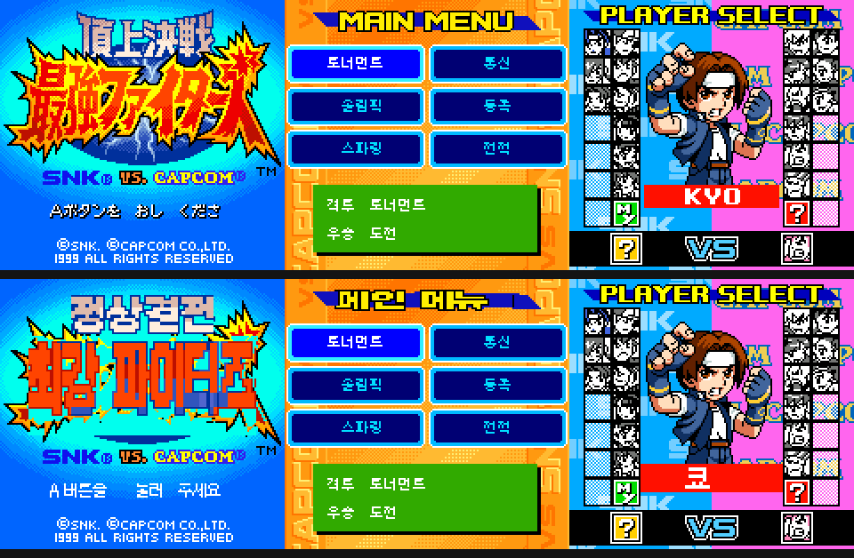

# SVC MotM 한글화 — 타이틀 · 메인메뉴 머리글

| | 원문 | 한글 | 방식 |
|---|---|---|---|
| 타이틀 머리글 | `頂上決戦` | **정상결전** | 타일맵 32타일 |
| 타이틀 큰 로고 | `最強ファイターズ` | **최강 파이터즈** | 타일맵 107타일 + SCR2 정리 111타일 |
| 캐릭터 이름판 18종 | `KYO` 등 | **쿄** 등 | 이름풀 스트립 — [`docs/SVC_이름판.md`](../../docs/SVC_이름판.md) |
| 타이틀 안내문 | `Aボタンを おし くださ` | **A버튼을 눌러 주세요** | 스프라이트 12타일 |

원판 안내문은 v17.2 에서 이미 「ください」의 「い」가 잘려 있다 — 12칸 중 10칸만 글자다.
| 메인메뉴 머리글 | `MAIN MENU` | **메인 메뉴** | 스프라이트 24타일 |

윗줄이 v17.2, 아랫줄이 적용 후다 (왼쪽 타이틀 / 오른쪽 메인메뉴).



```bash
python3 build_title_ko.py  SVC_kr_v17.2.ngc step1.ngc \
        --font Galmuri11-Bold.ttf --font7 Galmuri7.ttf
python3 build_header_ko.py step1.ngc        최종.ngc \
        --font Galmuri11-Bold.ttf
```

입력은 **한글판 v17.2** (`md5 213b7d3fec3555273c992ad91137fdf7`)다. 원본 롬이 아니다.
세 단계를 거친 결과가 `md5 24e3a6c7c8da6baa49c1bf0ff525e92a`, v17.2 대비 IPS 4,384바이트.
각 빌더의 `--ips`는 자기 입력 기준 차분을 만들고 왕복 검증까지 한다.

글꼴은 [Galmuri](https://github.com/quiple/galmuri) (SIL OFL 1.1) — 머리글 Galmuri11-Bold, 안내문 Galmuri7.

## 알아낸 것

**타일이 롬에 여러 벌 있고, 읽히는 것은 하나다.**
머리글 타일은 `0x1B6xxx`와 `0x306xxx`에 같은 내용으로 있다. 한쪽만 바꿔 부팅해 화면이
변하는지 보는 방법으로 **`+0x150000` 쪽이 읽히는 사본**임을 확정했다.
관측 기록의 `slot2rom`은 내용이 처음 일치한 주소라 실제 출처가 아닐 수 있다 — 이 경우가 그랬다.

**안내문은 타일맵에 없다. 스프라이트다.**
VRAM 512슬롯 중 두 타일맵이 참조하지 않는 슬롯을 추려 찾았다. 패턴 0~11번이
`x = 28,36,44,52,60, 76,84,92,100,108,116,124` / `y = 115`에 놓인다 (60→76 이 띄어쓰기).
원판 글자는 10자, 빈 칸은 패턴 7·11.
타일 출처는 `0x2E7F70`부터 16바이트씩 **연속**이다 — 내용이 세 곳에서 일치해 주소 추정이
안 되던 것을 연속 배치를 단서로 확정했다.

「A버튼을」 4자 · 「눌러」 2자 · 「주세요」 3자 = 9자가 원판의 세 덩어리에 그대로 들어간다.

**Galmuri7은 ppem 8에서 그려야 한다.**
size 7로 그리면 한글이 6×6으로 뭉개진다 (「을」이 「슬」처럼 보인다). ppem 8이면 7×7로
제대로 떨어진다. 글자마다 bbox로 잘라내면 기준선이 어긋나므로 **고정 원점**으로 그린다.

## 메인메뉴 머리글에서 알아낸 것

**머리글도 스프라이트다.** 13열 × 2줄 = 26칸(104×16px), `x=28+8i`, `y=6/14`.
열 i 의 패턴은 윗줄 `4+2i` · 아랫줄 `5+2i`.

**타일 뱅크를 재사용한다.** 26칸이 쓰는 고유 타일은 24장뿐이다 —
`MAIN` 의 M 과 `MENU` 의 M 이 같은 타일이라 `패턴4 == 패턴16` (ROM `0x22A830`),
`패턴26 == 패턴28` (`0x22A980`). **한 주소를 고치면 두 칸이 같이 바뀐다.**
빌더는 쓰기 전에 이 제약을 검사하고 어기면 멈춘다. 「메인 메뉴」는 두 자리를 모두 빈 칸으로
두는 배치라 제약을 만족한다.

**띠를 같이 그려야 한다.** 이 타일에는 글자만이 아니라 **뒤에 깔린 파란 띠**도 들어 있다.
글자만 그리고 나머지를 투명으로 두면 띠가 글자 자리마다 끊긴다 — 실제로 한 번 끊어 먹었다.
원판 띠는 왼쪽 행1~8 에서 오른쪽 행3~10 으로 기우는데, 기울이면 0열과 6열의 띠 높이가
달라져 공유 제약을 못 지킨다. 그래서 이 구간만 행2~9 로 평평하게 깐다.

**글자는 행 0~11(12px) 안에 넣는다.** 12~15행은 띠 밖이라 거기까지 그리면 글자가 띠 아래로
삐져나온다. 높이를 못 키우는 대신 **가로로 1.5배 늘려** 가독성을 얻었다
(Galmuri11-Bold ppem 11 → 잉크 10px, 가로만 1.5배).

**색 인덱스는 1=검은 외곽선, 2=노란 채움, 3=글자 뒤 파란 띠**다.
처음에 3을 외곽선으로 짚었다가 글자가 파랗게 나와 실측으로 바로잡았다.

## 안내문 글꼴 — 8x8 을 다 써야 한다

처음엔 Galmuri7(7x7)로 그렸는데 「을」이 「슬」로, 「요」가 「오」로 보였다.
**Galmuri9 를 ppem 9 로 그리고 1px 위로 올리면** 잉크가 8x8 을 꽉 채워 제대로 읽힌다.
7px 은 한글 종성이 들어갈 자리가 안 나온다.

## 큰 로고에서 알아낸 것

**로고는 두 평면에 걸쳐 있다.** SCR1 에 채움, **SCR2 에 외곽선 사본**이 따로 그려져 있다.
SCR1 만 고치면 SCR2 쪽 일본어 윤곽이 유령처럼 남는다. 그래서 원판 로고가 차지하던
픽셀 범위를 1px 부풀려 SCR2 에서 투명으로 지우는 2차 패스를 넣었다.

**맨 아랫줄(행10)은 못 쓴다.** 열9와 열10 이 한 슬롯(`0x1B7690`)을 공유해서 서로 다른
그림을 넣을 수 없다. 그리는 높이를 48px 로 제한하고 그 줄은 비워 둔다.

배치는 「최강 파이터즈」 한 줄, 가로 2배·세로 4배(음절당 약 19 × 40px).
원판도 한 줄이고 글자가 세로로 긴 비례라 거기에 맞췄다.

## 조판 원칙 — 픽셀 글꼴은 정수 배율로만

처음에 Galmuri11-Bold(11px)를 ppem 16 으로 렌더했다가 획이 갈라졌다.
11 -> 16 은 1.45배라 어떤 열은 1px, 어떤 열은 2px 이 된다.
**정수 배율로만 늘린다.** 지금은 이렇게 쓴다.

| 자리 | 글꼴 | 배율 | 결과 |
|---|---|---|---|
| 타이틀 머리글 | Galmuri11-Bold ppem11 | ×2 | 20px |
| 타이틀 안내문 | Galmuri9 ppem9 | ×1 | 8×8 (칸을 꽉 채운다) |
| 큰 로고 | Galmuri11-Bold ppem11 | 가로×2 세로×4 | 약 19×40px |
| 메인메뉴 머리글 | Galmuri11-Bold ppem11 | 가로×2 | 20×10px |
| 이름판 | Galmuri7 ppem8 | ×2 | 14×14 |

메인메뉴 머리글은 띠가 12px 뿐이라 세로를 못 키운다. **가로만 정수 2배**로 늘려
가독성을 얻는다 (1.5배로 늘렸다가 획이 고르지 않아 다시 짰다).

## 한계

- **쓸 수 있는 칸은 원판이 비어 있지 않던 자리뿐이다.** 타일맵을 못 고치므로 원판이 빈
  타일이던 칸에는 새 획을 못 넣는다. 머리글 가용 면적은 행1~3 × 열5~14 = **80×24px**이고,
  원판 「頂上決戦」이 쓰던 27px보다 3px 낮다. 그 안에 맞춰 짰다
- 타이틀 머리글은 원판이 획 아래에 분홍 음영을 두는데, 20px 한글에 그걸 넣으면 획이 흐려져
  오히려 안 읽힌다. 크림/남색 2톤으로 갔다
- 큰 로고는 글자를 바꿨을 뿐 **원판의 기울기·그라데이션은 재현하지 못했다.** 그건 글꼴
  렌더링으로 될 일이 아니라 사람이 그려야 한다
- SCR2 유령을 지우면서 **로고 뒤 폭발 배경도 같이 얇아졌다.** 일본어 윤곽과 배경 그림이
  같은 타일을 쓰기 때문이다. `--ghost-grow 0` 이면 배경이 더 남지만 윤곽 잔재도 남는다
- 나머지 머리글 3종(`GAME SELECT`·`STYLE SELECT`·`PLAYER SELECT`)은 아직이다.
  구조를 떠 보니 화면 전환 애니메이션 중이라 스프라이트 배치가 프레임마다 달라진다 —
  화면이 멈춘 시점을 잡는 경로가 먼저 필요하다
- IPS는 저장소에 넣지 않았다. **다른 사람의 한글판 v17.2 위에 얹는 차분**이라 배포는
  원작자 확인이 먼저다. 빌더로 각자 만들면 된다
