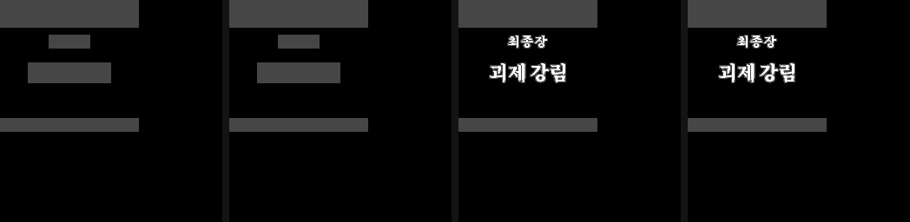
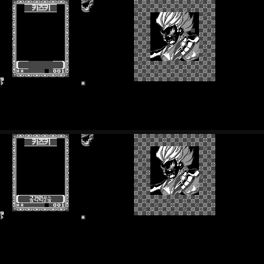
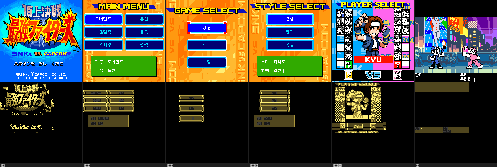

# NGPC 타일 관측기 + 오프라인 시뮬레이터 (검수툴)

에뮬로 화면을 한 번 기록해 두고, 이후에는 **에뮬 없이** 임의 롬으로 그 화면을 다시 그려
픽셀 회귀검사한다. 기록은 에뮬 1회, 검사는 **에뮬 0회 · 0.5초**다.

게임 비종속이다. 같은 도구가 SS2와 SVC에서 그대로 돈다.

## 왜 필요했나

정적 아이템 스캐너(그림 아이템 254종 전수 렌더)는 세 가지를 원리적으로 놓친다.

1. 타일이 스캔 창(`0x1D0000~0x1FFFFF`) 밖으로 이주하면 아이템이 통째로 안 잡힌다 — SS2 전수 스캔에서 16개 확인
2. 아이템 테이블을 안 거치고 타일을 직접 읽는 화면(나찰 판 유형)은 정적으로 영원히 안 보인다
3. 구버전 세이브스테이트의 VRAM 잔존 때문에 눈 검수로도 속는다

관측은 **화면에 뜬 것만 본다.** 위 세 가지가 사라진다.
SS2 기록 16화면의 타일 1,159개 중 **937개(80.8%)가 정적 스캔 창 밖**이었다.

## 세이브스테이트를 안 쓴다

화면 목록에 **콜드부트에서 그 화면까지 가는 조작 경로**를 적는다. 롬만 있으면 재현된다.
저장소에 게임 데이터가 안 남고, 남의 세이브스테이트에 의존하지도 않는다.

```json
{"name":"서장타이틀", "route":[["run",2850],["a",60],["a",60],["a",60],["a",60],["a",90],["a",120]]}
```

경로로 뜬 기록이 이전에 세이브스테이트로 뜬 기록과 **타일맵·slot2rom 모두 바이트 동일**임을
확인했다 (서장타이틀 299/299, 타이틀메뉴 44/44, 캐릭선택 58/58, 유파선택 85/85).

경로로 못 가는 화면(스토리 후반)은 `hunt.py`가 목표 기록을 정답표 삼아 자동으로 찾는다.

## 실측 확정한 VRAM 구조 (beetle-ngp)

문서에 없던 것을 프레임버퍼와 대조해 확정했다.

```
0x8032/33  SCR1 스크롤 X/Y      0x8034/35  SCR2 스크롤 X/Y
0x8300     스크롤 팔레트 (팔레트당 색 4개 × u16 RGB444)
0x9000     SCR1 타일맵 32×32 u16   ← SS2는 여기가 텍스트 평면
0x9800     SCR2 타일맵 32×32 u16   ← 배경 그림
0xA000     타일 패턴 512장 × 16B (2bpp, 행당 u16, 상위비트부터)
엔트리     pattern = v & 0x1FF
```

확정 방법: **아는 정답을 심어놓고 포맷을 역산했다.**
「괴제 강림」을 보수하며 `0x1EF9C0`에 심은 타일이 VRAM 어느 슬롯에 올라갔는지
내용 대조로 찾고, 그 슬롯을 참조하는 타일맵 엔트리를 역추적해 비트필드를 확정했다.
포맷 후보 대조 코드는 `ngp_vram.py`의 `fit_format()`에 남겼다.

## 도구

| | |
|---|---|
| `observe.py` | 조작 경로대로 게임을 굴려 화면별 `VRAM슬롯 → ROM주소` 기록 (**에뮬 필요한 유일한 단계**) |
| `regress.py` | 두 롬으로 기록을 오프라인 재렌더해 픽셀 비교 + 차이 이미지 |
| `ladder.py` | 한 화면을 여러 판으로 나란히 재렌더 (버전 사다리) |
| `coverage.py` | 화면에 실제로 뜬 타일 주소 요약 · 정적 스캔 창 사각지대 산출 |
| `diffmap.py` | **아직 원본 그대로인 타일**을 가려낸다 — 미번역 작업 목록이 그대로 나온다 |
| `hunt.py` | 경로로 못 가는 화면을 목표 기록 대조로 자동 추적해 세이브스테이트를 잡는다 |
| `tilemap.py` | 관측·재렌더 코어 |
| `ngp_vram.py` | VRAM 포맷 역산 연구 코드 (`fit_format`) |

```bash
# 1) 기록 (에뮬 1회). 롬을 바꿔 가며 같은 폴더에 돌리면 커버리지가 누적된다
python3 observe.py SS2_v0.99b.ngc rec_ss2/ screens_ss2.json
python3 observe.py SS2_v0.99b_allcards.ngc rec_ss2/ screens_ss2_allcards.json

# 2) 회귀검사 (에뮬 0회)
python3 regress.py rec_ss2/ 구판.ngc 신판.ngc diff_img/

# 3) 버전 사다리
python3 ladder.py rec_ss2/최종장타이틀.json out.png v0.63.ngc v0.95.ngc v0.98b.ngc v0.99b.ngc

# 4) 커버리지 — 정적 스캐너 사각지대
python3 coverage.py rec_ss2/ --window 1D0000:200000 --list

# 5) 미번역 잔여 타일 — 원본 롬과 대조
python3 diffmap.py rec_svc/ 원본.ngc 한글판.ngc 지도/ --csv 남은것.csv
```

필요한 것: `numpy`, `pillow`. 기록 단계만 추가로 트레이싱 패치를 얹은 beetle-ngp 코어가 필요하다
(`SS1_SamuraiShodown_NGP/emulator/beetle-ngp-tracing.patch`, 경로는 `--core` 또는 `NGP_CORE`).

- `rec_*/*.json` — 화면별 타일맵 + `VRAM슬롯 → ROM주소` 지도. **ROM 데이터는 안 들어 있다**
- `rec_*/_coverage.json` — 그 화면들에 실제로 뜬 ROM 타일 주소 전체

## 검증 1 — 에뮬 없이 파손 이력이 재현된다

v0.99b에서 뜬 최종장 타이틀 기록 하나로 네 판을 오프라인 재렌더한 결과다.



| 롬 | 결과 |
|---|---|
| v0.63 · v0.95 | 명판만, 글자 없음 — 「괴제 강림」 파손 재현 |
| v0.98b · v0.99b | **「최종장 / 괴제 강림」 정상** |

## 검증 2 — 변경 이력을 독립적으로 다시 잡아낸다

16화면 기록으로 v0.98b→v0.99b를 비교하면 **v0.99b에서 손댄 화면 4개만** 차이가 난다.
변경 내역에 적힌 "카드 종류 라벨 5종 재조판"과 정확히 같은 화면들이다.

```
$ python3 regress.py rec_ss2 v0.98b.ngc v0.99b.ngc
능력추가_고르기       픽셀차    270  바뀐타일  12  <-- 차이
능력추가_정하기       픽셀차    270  바뀐타일  12  <-- 차이
카드목록           픽셀차    270  바뀐타일  12  <-- 차이
카드앞면           픽셀차    329  바뀐타일  13  <-- 차이
차이난 화면 4개          (나머지 12화면 픽셀차 0)
```

위가 v0.98b, 아래가 v0.99b. 명판이 검게 뭉개져 있던 것이 「공격력상승」으로 바뀐 게 잡힌다.



v0.95→v0.99b는 6화면, v0.99b→v0.99b는 0화면. 16화면 두 롬 비교에 0.5초 걸린다.

## 검증 3 — 다른 게임(SVC)에 그대로 물린다

SNK vs Capcom MotM 한글판 v17.2를 조작 경로 9화면으로 관측하고, 원본 롬과 대조했다.
판정은 주소가 아니라 **내용**으로 한다 — 화면에 뜬 타일의 16바이트가 원본 롬 어디에도
없으면 새로 그린 타일이다. (4MB 롬에서는 같은 타일이 여러 주소에 중복돼 주소 비교가 흔들린다.)

윗줄이 실제 화면, 아랫줄이 **원본 그대로인 타일만 밝게** 칠한 지도다.



| 화면 | 뜬 타일 | 새 타일 | 원본 잔여 |
|---|---|---|---|
| 타이틀 | 417 | **0** | 417 |
| 메인메뉴 | 208 | 26 | 182 |
| 게임선택 | 107 | 5 | 102 |
| 스타일선택 | 191 | 15 | 176 |
| 플레이어선택 | 335 | **0** | 335 |
| VS · 월드맵 · 대전준비 | 724 | **0** | 724 |
| 전투 | 276 | 7 | 269 |
| **합계(고유)** | **1,551** | **41** | **1,510** |

타이틀 「頂上決戦 最強ファイターズ」와 「Aボタンを おし ください」, 그리고
`MAIN MENU` · `GAME SELECT` · `STYLE SELECT` · `PLAYER SELECT` 머리글이 전부 원본 그대로다.
`--csv`가 그 타일 주소를 화면별로 뽑아 준다 — **타일 이름 풀한글화의 작업 목록**이 그대로 나온다.

참고로 같은 방식으로 잰 SS2 v0.99b는 1,159개 중 **321개가 새 타일(28%)**, SVC v17.2는 2.6%다.

## 한계 (정직하게)

- **방문하지 않은 화면은 여전히 안 잡힌다.** 커버리지를 자동화할 뿐 완전성을 주지는 않는다
- 스프라이트·애니메이션·스크롤 합성은 재현 대상이 아니다. 텍스트 평면만 정확하다
- 팔레트 뱅크가 화면마다 달라 **색 재현은 미완**이다. 회귀 비교는 회색조라 결과에 영향이 없다
- 시뮬레이터는 **기록된 타일맵을 고정**하고 롬만 갈아 끼운다. 구판에서 타일이 다른 주소에
  있었다면 그 자리는 빈 칸으로 나온다 — 파손·이주를 드러내는 데는 정확하지만,
  구판 실기 화면과 픽셀까지 같다는 뜻은 아니다
- 런타임에 만들어진 타일(ROM에 같은 16B가 없는 것)은 기록에서 빠진다
- `diffmap.py`의 "원본 잔여"에는 **그림 타일도 섞인다.** 미번역 글자만 걸러내지는 못한다
- **`rec_ss2/최종장타이틀.json` 한 건만 세이브스테이트로 뜬 기록이다.** 스토리 8장을 이겨야
  닿는 화면이라 조작 경로가 없다. `hunt.py`의 마구잡이 정책으로는 25만 프레임까지 못 닿았다 —
  이 화면을 경로로 재현하려면 진행 치트나 더 나은 정책이 필요하다
